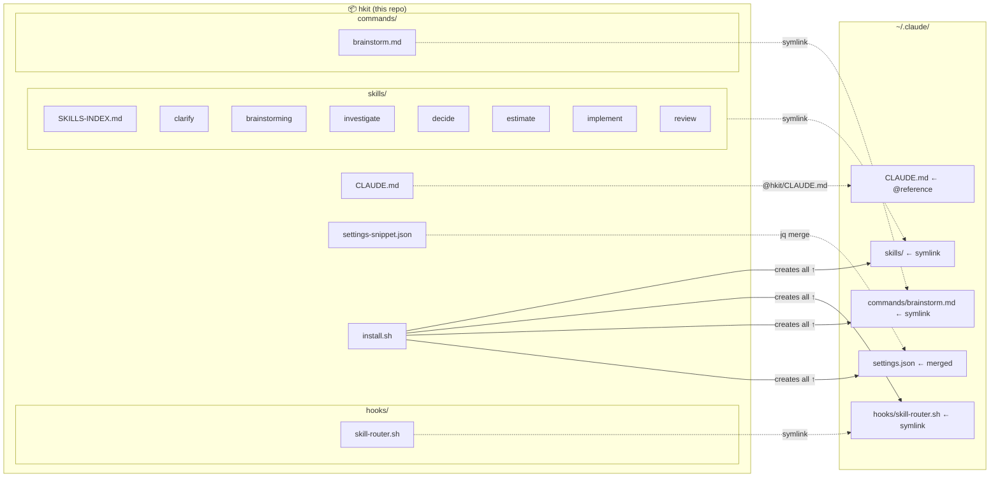
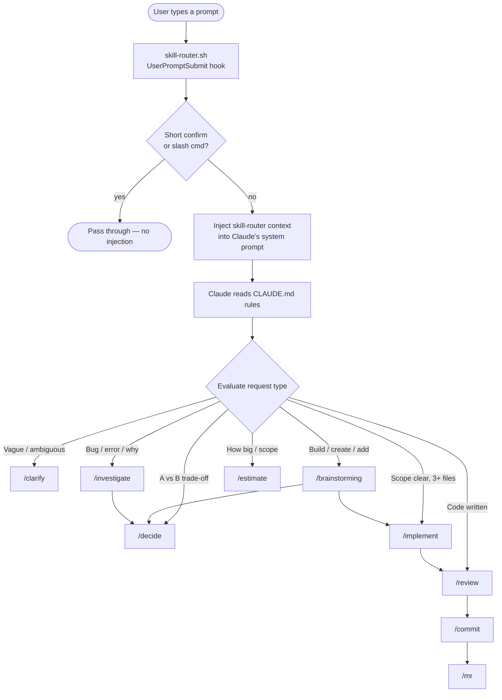
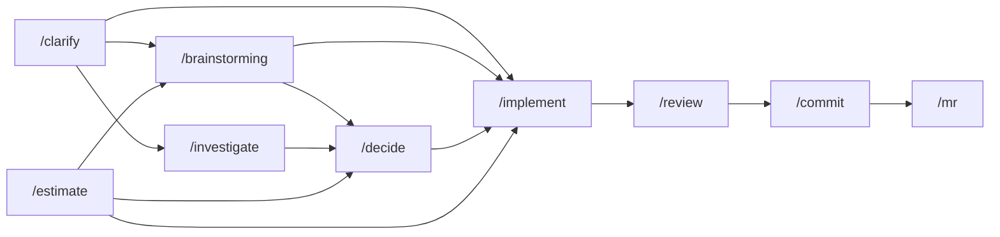

# hkit

Centralized Claude Code skill kit. One repo to own, version, and share your Claude Code workflow system.

**What's inside:** 7 skills + a skill-router hook + a brainstorm command + workflow rules. Everything wires together to make Claude evaluate _how_ to help before it starts helping.

## Install

```bash
git clone https://github.com/hohieuu/hkit ~/Documents/hkit && ~/Documents/hkit/install.sh
```

Then add one line to `~/.claude/CLAUDE.md`:

```
@~/Documents/hkit/CLAUDE.md
```

Open a new Claude Code session — the skill system is active.

---

## Component Map



---

## Runtime Flow

How a user prompt becomes a skill invocation:



---

## Skill Chaining



---

## Install (details)

**Requirements:** `bash`, `jq`

See the one-liner at the top. The script is idempotent — safe to re-run after pulling updates.

### What install.sh does

| Action | Details |
|--------|---------|
| Symlink `skills/` | `~/.claude/skills` → `hkit/skills/` |
| Symlink hook | `~/.claude/hooks/skill-router.sh` → `hkit/hooks/skill-router.sh` |
| Symlink command | `~/.claude/commands/brainstorm.md` → `hkit/commands/brainstorm.md` |
| Merge settings | Adds skill-router to `~/.claude/settings.json` (preserves existing hooks) |
| Reminder | Prints the CLAUDE.md `@reference` line to add manually |

The script is **idempotent** — safe to run again after updates.

---

## Components

### Skills (`skills/`)

| Skill | Command | When to use |
|-------|---------|-------------|
| **clarify** | `/clarify` | Request is vague or has multiple interpretations |
| **brainstorming** | `/brainstorming` | Building, creating, or adding new functionality |
| **investigate** | `/investigate` | Bug, error, or unexpected behavior |
| **decide** | `/decide` | Choosing between options with trade-offs |
| **estimate** | `/estimate` | "How big is this?" / scope planning |
| **implement** | `/implement` | Scope is clear, ready to write code (3+ files) |
| **review** | `/review` | Code is written, check quality before committing |

See [`skills/SKILLS-INDEX.md`](skills/SKILLS-INDEX.md) for the full chaining map and tool usage matrix.

### Hook (`hooks/skill-router.sh`)

Fires on every `UserPromptSubmit`. Injects a brief skill-routing checklist into Claude's context so it evaluates _which skill to use_ before acting. Skips injection for slash commands and short confirmations (≤2 words).

Registered in `~/.claude/settings.json` under `hooks.UserPromptSubmit`.

### Command (`commands/brainstorm.md`)

`/brainstorm` → redirects to `/brainstorming` skill. Shorthand alias.

### Rules (`CLAUDE.md`)

Loaded via `@reference` in `~/.claude/CLAUDE.md`. Contains the proactive skill usage table and clarification gate rules. These are read by Claude at the start of every session.

---

## Adding a New Skill

1. Create `skills/<name>/SKILL.md` with the skill definition
2. Add an entry to `skills/SKILLS-INDEX.md` (skill table + chaining map)
3. Optionally add a `/name` entry to `commands/` as an alias
4. Update `CLAUDE.md` if the skill needs a new proactive trigger rule

Since `~/.claude/skills` is a symlink to this repo, changes are live immediately — no re-install needed.

---

## Verification

After install, check everything is wired:

```bash
# Symlinks
ls -la ~/.claude/skills          # → points to hkit/skills/
ls -la ~/.claude/hooks/skill-router.sh  # → points to hkit/hooks/

# Settings merge
cat ~/.claude/settings.json | jq '.hooks.UserPromptSubmit'

# Live edit test: change a skill, verify it's visible
echo "# test" >> skills/clarify/SKILL.md
cat ~/.claude/skills/clarify/SKILL.md | tail -1  # should show "# test"
git checkout skills/clarify/SKILL.md             # revert
```
